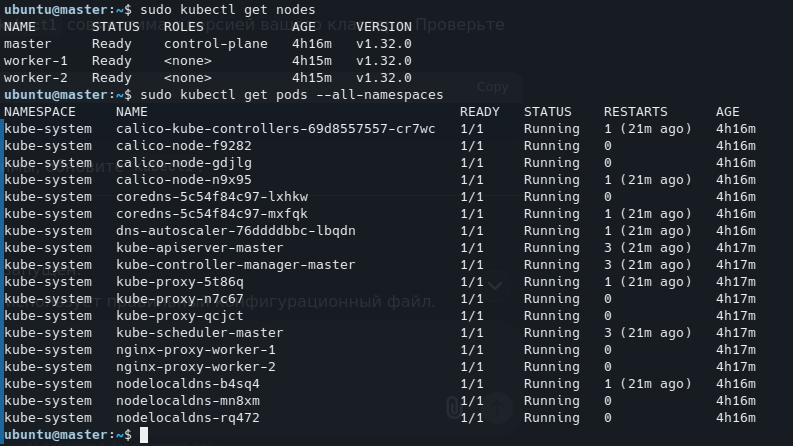
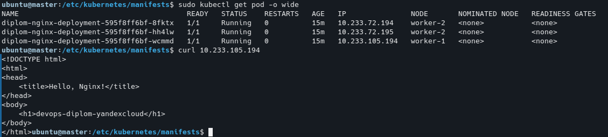

### Создание облачной инфраструктуры
1. Создание сервесного аккаунта [service_account.tf](terraform/s3/service_account.tf)
2. Создание бакета [S3b.tf](terraform/s3/S3b.tf)
3. Создание произошло успешно 


Переменные secret_key и access_key копируются в "secret_key.tfvars" и "access_key.tfvars"

### Создане приложения
```
docker login
docker build -t neto-test-nginx
docker tag neto-test-nginx:latest kuxar/neto-test-nginx:latest
docker push kuxar/neto-test-nginx:latest
```
[Dockerfile](doc/Dockerfile)

[index.html](doc/index.html)

[nginx.conf](doc/nginx.conf)

### Создание Kubernetes кластера

1. Создание VPC [vpc.tf](terraform/kub/vpc.tf)
2. Создание 2 воркер нод [worker.tf](terraform/kub/worker.tf)
3. Создание 1 мастер ноды [master.tf](terraform/kub/master.tf)
4. При установке необходимо добавить переменную 
```
$ACCESS_KEY="<идентификатор_ключа>"
$SECRET_KEY="<секретный_ключ>"
```
5. Начинаем установку 
```
terraform init -backend-config="access_key=$ACCESS_KEY" -backend-config="secret_key=$SECRET_KEY"
   ```
 Установка прошла успешно 


6. Установка кластера кубера
```
python -m venv myenv
```
```
source myenv/bin/activate
```
```
pip install -r requirements.txt
```
```
ansible-playbook -i inventory/mycluster/hosts.yaml -u ubuntu --become --become-user=root --private-key=/home/deck/.ssh/id_ed25519 -e 'ansible_ssh_common_args="-o StrictHostKeyChecking=no"' cluster.yml --flush-cache
```

7. Проверка кластера куба и приложения
```
sudo kubectl apply -f deploy.yaml
sudo kubectl apply -f service.yaml
sudo kubectl apply -f grafana.yaml
```






8. установка мониторинга с помощью Helm
```
sudo helm repo add prometheus-community https://prometheus-community.github.io/helm-charts
```
```
sudo helm repo update
```
```
sudo helm install prometheus-stack  prometheus-community/kube-prometheus-stack
```
```
sudo   kubectl --namespace default get secrets prometheus-stack-grafana -o jsonpath="{.data.admin-password}" | base64 -d ; echo
prom-operator
```


### CICD

1. Подготовил ci/cd манифест

[CICD.yml](.github/workflows/CICD.yml)

```
name: CICD

env:
  IMAGE_NAME: ${{ secrets.DOCKER_USERNAME }}/neto-test-nginx
  TAG: ${{ github.run_number }}
  FILE_TAG: ./environments/value_tag
  VARS_APP_REPO: ${{ vars.APP_REPO }}
  REPO_DIR: nginx
  
on:
  push:
    branches:
    - main
    tags:
    - '*'
   
jobs:

  build:
    outputs:
      image_tag: ${{ env.TAG }}
    runs-on: ubuntu-latest

    steps:
    
    - name: Get files
      uses: actions/checkout@v3

    - name: Set env TAG
      id: step_tag
      run: echo "TAG=$(echo ${GITHUB_REF:10})" >> $GITHUB_ENV
      if: startsWith(github.ref, 'refs/tags/v')
      
    - name: Build the Docker image
      run: docker build ./doc --file ./doc/Dockerfile --tag ${{ env.IMAGE_NAME }}:${{ env.TAG }}
    
    - name: Push the Docker image
      run: |
        docker login --username ${{ secrets.DOCKER_USERNAME }} --password ${{ secrets.DOCKER_PASSWORD }}
        docker push ${{ env.IMAGE_NAME }}:${{ env.TAG }}


  deploy: 
    
    needs: build
    if: github.ref == 'refs/heads/main'
    runs-on: ubuntu-latest

    steps:

    - name: Update application
      env:
        tag: ${{ needs.build.outputs.image_tag }}
      uses: appleboy/ssh-action@v1.0.3
      with:
        host: ${{ secrets.SSH_HOST }}
        username: ${{ secrets.SSH_USERNAME }}
        key: ${{ secrets.SSH_KEY }}
        port: ${{ secrets.SSH_PORT }}
        script: |
          sudo su 

          sudo kubectl delete -f /etc/kubernetes/manifests/git/devops-diplom-yandexcloud/terraform/kub/yml/deploy.yaml
          sudo kubectl delete -f /etc/kubernetes/manifests/git/devops-diplom-yandexcloud/terraform/kub/yml/service.yaml
          sudo rm -rf /etc/kubernetes/manifests/git/devops-diplom-yandexcloud
          cd /etc/kubernetes/manifests/git
          sudo rm -rf git/devops-diplom-yandexcloud
          sudo git clone https://github.com/NeTrogajSvetchu/devops-diplom-yandexcloud.git
          cd /etc/kubernetes/manifests/git/devops-diplom-yandexcloud
          sudo sed -i "s|{{image_tag}}|${{ env.tag }}|g" terraform/kub/yml/deploy.yaml
          sudo kubectl apply -f terraform/kub/yml/deploy.yaml
          sudo kubectl apply -f terraform/kub/yml/service.yaml
          sudo kubectl get po,svc
```
Манифест для кода тераформ
```
name: Yandex Cloud Terraform CI/CD

on:
  push:
    branches: [main]
  pull_request:
    branches: [main]
  workflow_dispatch:

env:
  TF_VERSION: "1.5.7"
  TF_BACKEND_BUCKET: "storage-website-test"
  YC_STORAGE_ENDPOINT: "https://storage.yandexcloud.net"
  YC_REGION: "ru-central1"

jobs:
  validate:
    runs-on: ubuntu-latest
    steps:
      - uses: actions/checkout@v4
      
      - name: Setup Terraform
        uses: hashicorp/setup-terraform@v2
        with:
          terraform_version: ${{ env.TF_VERSION }}
          
      - name: Terraform Init (Light)
        working-directory: ./terraform/kub
        run: terraform init -backend=false
          
      - name: Terraform Validate
        working-directory: ./terraform/kub
        run: terraform validate
        
      - name: Terraform Format Check
        working-directory: ./terraform/kub
        run: |
          terraform fmt -check -recursive || echo "::warning::Some Terraform files need formatting"
          terraform fmt -recursive  # Автоисправление форматирования
          git diff --exit-code || echo "::notice::Fixed formatting automatically"

  deploy:
    needs: validate
    runs-on: ubuntu-latest
    environment: production
    permissions:
      contents: read
      id-token: write  # Для OIDC аутентификации
    
    steps:
      - uses: actions/checkout@v4

      - name: Setup Terraform
        uses: hashicorp/setup-terraform@v2
        with:
          terraform_version: ${{ env.TF_VERSION }}
          terraform_wrapper: false

      - name: Configure AWS CLI for Yandex Cloud
        run: |
          aws configure set aws_access_key_id ${{ secrets.YC_STORAGE_ACCESS_KEY }}
          aws configure set aws_secret_access_key ${{ secrets.YC_STORAGE_SECRET_KEY }}
          aws configure set default.region ${{ env.YC_REGION }}
          aws --endpoint-url ${{ env.YC_STORAGE_ENDPOINT }} s3 ls s3://${{ env.TF_BACKEND_BUCKET }} || echo "Bucket access check"

      - name: Terraform Init
        working-directory: ./terraform/kub
        run: |
          terraform init -reconfigure \
            -backend-config="access_key=${{ secrets.YC_STORAGE_ACCESS_KEY }}" \
            -backend-config="secret_key=${{ secrets.YC_STORAGE_SECRET_KEY }}" \
            -backend-config="endpoint=${{ env.YC_STORAGE_ENDPOINT }}" \
            -backend-config="bucket=${{ env.TF_BACKEND_BUCKET }}" \
            -backend-config="region=${{ env.YC_REGION }}" \
            -backend-config="skip_region_validation=true" \
            -backend-config="force_path_style=true"


      - name: Terraform Plan
        working-directory: ./terraform/kub
        env:
          YC_TOKEN: ${{ secrets.YC_TOKEN }}
          YC_CLOUD_ID: ${{ secrets.YC_CLOUD_ID }}
          YC_FOLDER_ID: ${{ secrets.YC_FOLDER_ID }}
        run: |
          # Выполняем plan и сохраняем вывод в файл
          terraform plan -out=tfplan \
            -var="token=$YC_TOKEN" \
            -var="cloud_id=$YC_CLOUD_ID" \
            -var="folder_id=$YC_FOLDER_ID" > plan_output.txt
          
          # Фильтруем вывод, оставляя только изменения
          grep -E '(^  #|^  \+|^  \-|^  ~|^Plan:)' plan_output.txt | tee filtered_plan.txt
          
          # Добавляем аннотацию в GitHub UI
          echo "::notice::$(cat filtered_plan.txt)"
          
          # Сохраняем план как артефакт
          echo "PLAN_OUTPUT<<EOF" >> $GITHUB_ENV
          cat filtered_plan.txt >> $GITHUB_ENV
          echo "EOF" >> $GITHUB_ENV
          
          # Всегда завершаем успешно, даже если есть изменения
          exit 0

      - name: Terraform Apply
        working-directory: ./terraform/kub
        run: terraform apply -auto-approve tfplan
        if: github.ref == 'refs/heads/main' && github.event_name == 'push'
```
2. Добавил секреты и переменую в actions


3. Произвел изменение в [index.html](doc/index.html)

Было 


Стало


4. Автоматическая сборка docker image и деплоя приложения при изменении кода.


### Чек-лист

1. Репозиторий с конфигурационными файлами Terraform и готовность продемонстрировать создание всех ресурсов с нуля.

    [Terraform](terraform)

2. Пример pull request с комментариями созданными atlantis'ом или снимки экрана из Terraform Cloud или вашего CI-CD-terraform pipeline.

    Все есть в пунктах выполнения CICD 
    

3. Репозиторий с Dockerfile тестового приложения и ссылка на собранный docker image.

    [Докер](doc) 
    
    https://hub.docker.com/repository/docker/kuxar/neto-test-nginx/general

4. Репозиторий с конфигурацией Kubernetes кластера.

    [Kubernetes](terraform/kub)

5. Ссылка на тестовое приложение и веб интерфейс Grafana с данными доступа.
    
    Оба будут недоступнты так как закончились гранты в YaCloud 

    Тестовое приложение - http://158.160.172.139/

    Grafana             - http://51.250.46.83:3000/login 
    
    Логин - admin

    Пароль - prom-operator


