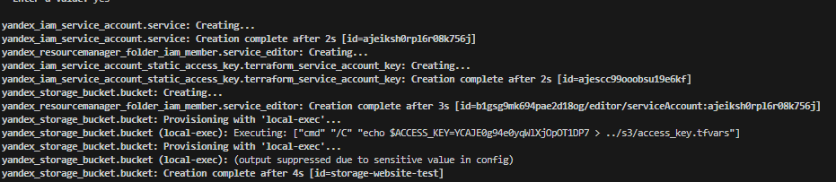
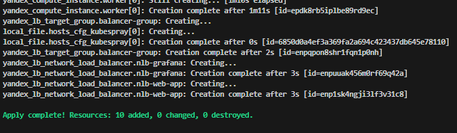
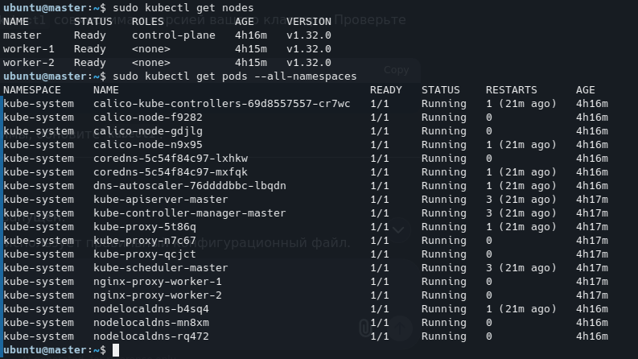
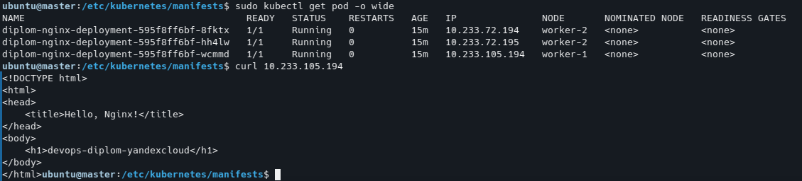
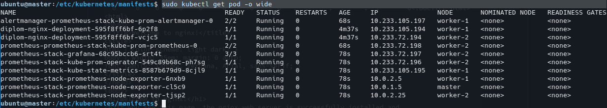
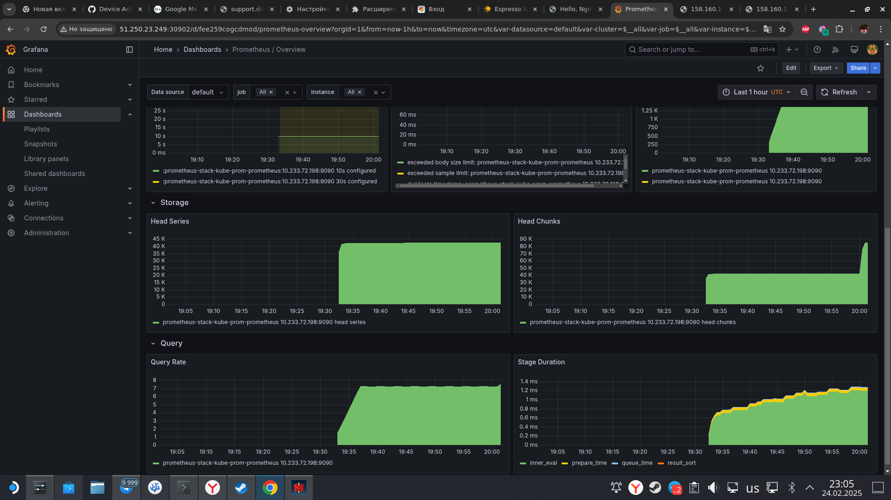

### Создание облачной инфраструктуры
yandex_vpc_subnet.diplom-subnet-b.id
yandex_vpc_subnet.diplom-subnet-a.id
master.network_interface[0].nat_ip_address
worker.network_interface[0].nat_ip_address
fyq     wet

export ACCESS_KEY="<идентификатор_ключа>"
export SECRET_KEY="<секретный_ключ>"
terraform init -backend-config="access_key=$ACCESS_KEY" -backend-config="secret_key=$SECRET_KEY"

 
 
### Создание облачной инфраструктуры
1. Создание сервесного аккаунта [service_account.tf](terraform/s3/service_account.tf)
2. Создание бакета [S3b.tf](terraform/s3/S3b.tf)
3. Создание произошло успешно 

Переменные secret_key и access_key копируются в "secret_key.tfvars" и "access_key.tfvars"

### Создание Kubernetes кластера

1. Создание VPC [vpc.tf](terraform/kub/vpc.tf)
2. Создание 2 воркер нод [worker.tf](terraform/kub/worker.tf)
3. Создание 1 мастер ноды [master.tf](terraform/kub/master.tf)
4. При установке необходимо добавить переменную 

$ACCESS_KEY="<идентификатор_ключа>"
$SECRET_KEY="<секретный_ключ>"

5. Начинаем установку 
   "terraform init -backend-config="access_key=$ACCESS_KEY" -backend-config="secret_key=$SECRET_KEY""
6. Установка прошла успешно 

docker login
docker build -t neto-test-nginx
docker tag neto-test-nginx:latest kuxar/neto-test-nginx:latest
docker push kuxar/neto-test-nginx:latest

7.
python -m venv myenv
source myenv/bin/activate
pip install -r requirements.txt
ansible-playbook -i inventory/mycluster/hosts.yaml -u ubuntu --become --become-user=root --private-key=/home/deck/.ssh/id_ed25519 -e 'ansible_ssh_common_args="-o StrictHostKeyChecking=no"' cluster.yml --flush-cache

Проверка кластера куба
sudo kubectl apply -f deploy.yaml
sudo kubectl apply -f service.yaml
sudo kubectl apply -f grafana.yaml

sudo helm repo add prometheus-community https://prometheus-community.github.io/helm-charts
sudo helm repo update
sudo helm install prometheus-stack  prometheus-community/kube-prometheus-stack
sudo   kubectl --namespace default get secrets prometheus-stack-grafana -o jsonpath="{.data.admin-password}" | base64 -d ; echo
prom-operator

cicd